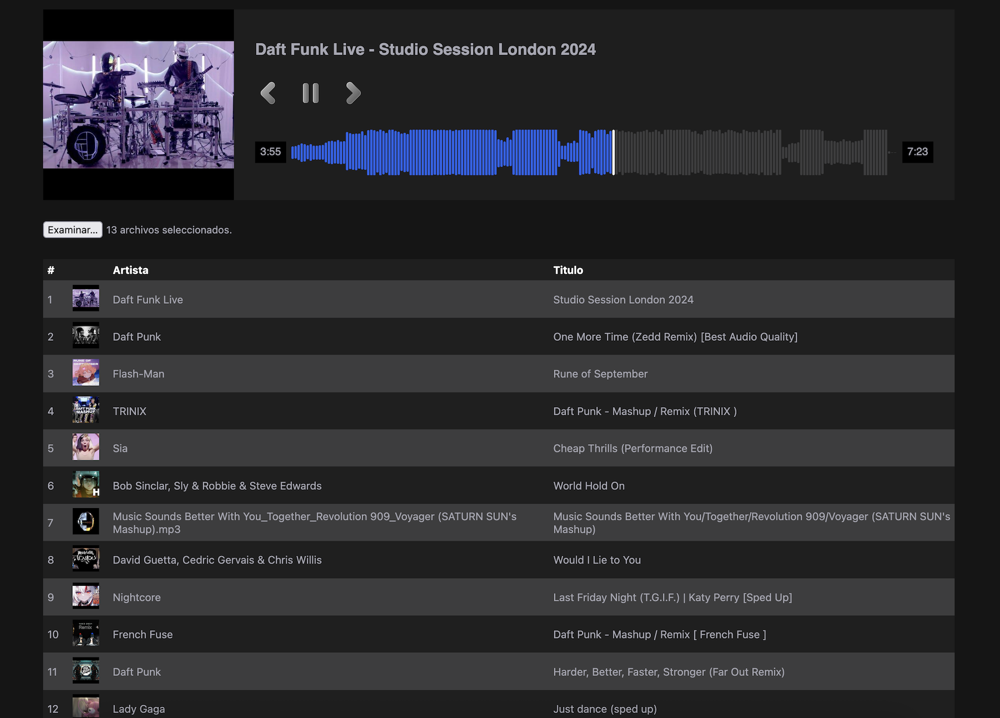

# WAVEFLOW music player

[](#)
[](#)
[](#)

### Run for development using vite

```bash
npm install
npm run dev
```

### Third party libraries

-   Wavesurfer
-   Music Metadata

### Pull request are allowed

### Screenshots


